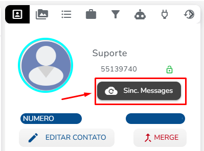

# WhatsApp (Web) - Boas práticas de uso

> O Celular pode ficar por 14 dias offline/desligado que a plataforma continuará a funcionar, mas recomendamos manter sempre a sincronização ativa com o celular online e carregado.


**Atenção!**\
Tenha mais segurança para a sua empresa, conheça nossos planos para Whatsapp API Oficial [clique aqui](https://simplesdesk.com.br/)


Com base no nosso próprio uso, percebemos que algumas boas práticas ajudam a ter uma experiência melhor usando o WhatsApp na Flowseller.


Quando o seu celular e a Flowseller não conseguem se conectar entre si, a troca de mensagens pode ficar instável.


Embora o Meta tenha desenvolvido o multi-devices para não ser dependente do aparelho, ainda sim com um grande volume de mensagens, podemos encontrar em alguns casos falta de sincronismo e desconectividade entre o aparelho e a conexão feita com o QR Code.

### Boas práticas 

* É recomendado que o celular esteja com 100% de bateria e conectado na tomada 24 horas por dia ([Isso pode viciar a minha bateria?](https://tecnoblog.net/189854/bateria-vicia-efeito-memoria/)). Isso evita que o aparelho crie processos automáticos de economia de bateria e coloque o WhatsApp em segundo plano.\\
* Utilizar um modelo de aparelho celular recomendado. (Verifique os modelos recomendados abaixo). Aparelhos muito antigos não acompanham as atualizações do aplicativo de WhatsApp.\\
* O sistema operacional do celular e o aplicativo do WhatsApp deverão estar atualizados para a última versão. Descubra a sua versão Android clicando [aqui](https://support.google.com/android/answer/7680439?hl=pt-BR) ou iOS clicando [aqui](https://support.apple.com/pt-br/HT201685).\\
* Recomendado utilizar o celular exclusivamente para a integração com a Flowseller. Caso utilize também para navegar por outros aplicativos, a prioridade no processamento não será do WhatsApp.\\
* Responder as conversas sempre pela Flowseller, as mensagens respondidas pelo aparelho podem não sincronizar com a Flowseller.

### Velocidade de Conexão 

Se não for possível se conectar ainda que o modelo de celular seja adequado e o sistema operacional e o aplicativo estejam atualizados, você deve verificar a velocidade da sua internet.

Mas, antes, veja se é possível enviar ou receber mensagens no WhatsApp deste aparelho. Se não conseguir, também não será possível usar o WhatsApp no seu Flowseller.

Caso seja possível enviar e receber uma mensagem, mas ainda assim não consiga se conectar, é hora de testar a velocidade. Para descobrir se a sua conexão atual atende os pré-requisitos, [clique aqui](https://www.speedtest.net/).

#### Requisitos mínimos de velocidade: 

Download: velocidade mínima de 30 Mbps;\
Upload: velocidade mínima de 15 Mbps;\
Ping ou latência: abaixo de 40 ms (quanto mais baixo for o tempo, melhor será a conexão).

Caso não atenda aos requisitos, entre em contato com o seu provedor de internet.

**IMPORTANTE: O teste de velocidade deve ser realizado no aparelho onde está instalado o aplicativo do WhatsApp que está integrado com a** Flowselle&#x72;**.**

Site recomendado para teste:

[https://www.minhaconexao.com.br/](https://www.minhaconexao.com.br/)

### Ainda não resolveu seu problema? Vejas mais algumas dicas: 

* Evite responder as conversas pelo celular ou pelo WhatsApp Web, isso pode causar conflito na sua conexão.
* Faça a leitura do QR Code do WhatsApp na Flowseller novamente e reinicie o celular para “forçar” o envio de mensagens, ao conectar no painel de atendimento, selecione uma conversa e clique em Sincronizar Mensagem

<figure><figcaption></figcaption></figure>

* Esteja conectado ao wi-fi e próximo do roteador, a no máximo 2 metros de distância. Isso garante a estabilidade da conexão com a internet e maior velocidade.
* Use o QR Code apenas com uma sessão da Flowseller. Caso você tenha outra sessão aberta, pode haver instabilidade na conexão.

#### Como funciona a conexão entre a Flowseller e o meu celular? 

O WhatsApp utiliza o celular como servidor, ou seja, as conversas chegam primeiro no celular e depois na Flowseller, bem parecido com o que acontece com o WhatsApp Web. Qualquer atitude que faça com que o seu celular coloque o WhatsApp em segundo plano, como bateria com carga baixa ou o uso de outros aplicativos ao mesmo tempo, vão trazer instabilidades na conexão.

Para melhor atendê-lo, a Flowseller conta também com o plano WhatsApp Oficial (API). Nele não há problemas de conexão, pois não é necessário reservar um celular para usar como servidor. Neste caso, a solução da própria Meta utiliza servidores dedicados para a tarefa. [Clique aqui](https://simplesdesk.com.br/) para saber mais sobre o WhatsApp Oficial API.

### Qual modelo de celular usar? 

O modelo do seu celular é um dos principais requisitos para uma boa conexão entre com a Flowseller. Veja os aparelhos recomendados:

<figure><figcaption></figcaption></figure>

**Android**\
Aparelho: modelos a partir do ano de 2022.\
Sistema operacional: Android 5.0 Lollipop ou superior.\
Aplicativo WhatsApp ou WhatsApp Business: última versão dos aplicativos. Em caso de dúvidas, verifique se existem atualizações no Google Play do seu aparelho.

iPhone\
Aparelho: iPhone 11 ou superior.\
Sistema operacional: iOS 13 ou superior.\
Aplicativo WhatsApp ou WhatsApp Business: última versão dos aplicativos. Em caso de dúvidas, verifique se existem atualizações na App Store do seu aparelho.

***

Caso tenha alguma dúvida, é só chamar nosso time de suporte da Flowseller. Ou, se preferir, chame através do nosso Whatsapp.😉 :heart\_hands:
