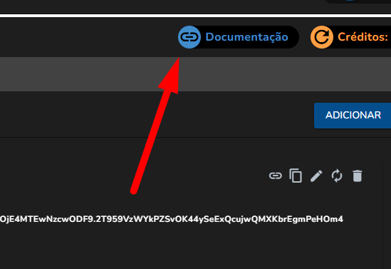
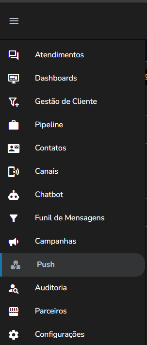

# Funil de Mensagens

Veja este Tutorial interativo:




**USE COM CUIDADO - RISCO DE BANIMENTO DO WHATSAPP ALTISSÍMO**



Veja as regras para poder utilizar o WhatsApp juntamente com seu serviço de Funil e evite banimentos pela ferramenta.


Atualmente, o WhatsApp é uma ferramenta indispensável para manter o contato com clientes atuais e potenciais, mas saiba que seu número de WhatsApp pode ser banido, caso não siga algumas diretrizes e regras do WhatsApp.

* Para reduzir significativamente o risco de isso acontecer, leia abaixo o que não pode ser feito no WhatsApp.

**Envio em massa de mensagens para pessoas que não conhecem sua empresa**

* Um dos motivos mais frequentes de banimento é o contato ser classificado como spam. Sua empresa corre esse risco ao enviar mensagem para diversos recipientes que não a têm adicionada como contato ou não a conhecem.

**Ser denunciado ou bloqueado por diversos números**

* Parecido com o tópico citado acima, a denúncia por spam, conteúdo inadequado ou bloqueio por diversos números pode acarretar o banimento da conta

**Vender produtos não autorizados**

* Se sua empresa vende ou divulga produtos através do WhatsApp, saiba que não é permitido vender produtos enganosos, falsos, ilusórios, ofensivos ou que não sejam permitidos pelo WhatsApp. Para conferir a lista oficial completa [**clique aqui**](https://www.whatsapp.com/legal/commerce-policy/?lang=pt_br)

**Automação irregular do WhatsApp**

* Empresas que utilizam ferramentas não oficiais para automação do envio de mensagem pelo WhatsApp ou realizam alguma automação não permitida podem ter seu número banido da plataforma.

**Utilizar versões alternativas ou modificadas do WhatsApp**

* Utilizar plataformas não oficiais do WhatsApp que interferem nas funcionalidades do WhatsApp são um risco para a sua empresa e os dados transacionados entre ela e os clientes.
* Além da chance de seu número ser banido, pode ocorrer perda de dados, falha de segurança e outros problemas.

Para melhor atendê-lo, a Flowseller conta também com o plano WhatsApp Oficial (API). Nele não há problemas de conexão, e as campanhas em massa são autorizadas e controladas pela Meta, pois não é necessário reservar um celular para usar como servidor. Neste caso, a solução da própria Meta utiliza servidores dedicados para a tarefa. Entre em contato com o time comercial ou suporte para saber mais sobre o WhatsApp Oficial API. ([https://flowseller.com.br/](https://flowseller.com.br/))

### Criando um funil de automação

Acesse no **menu lateral esquerdo > Funil**

<figure><figcaption></figcaption></figure>

Em seguida clique em **Novo**\
**Digite o nome do funil, selecione o canal e a ação**\
**Após configure cada etapa/mensagem que vai ser enviada, é permitido Texto, imagem, áudio, vídeo, e documentos gerais em seguida clique em salvar**


**Atenção aos minutos de disparo entre cada etapa/mensagem**


<figure><figcaption></figcaption></figure>

É possível em cada etapa do funil a adição automática de **Etiquetas** e alteração do **Status do Lead** em seu Kanban

Para usar o funil, você pode vincular em um Motivo de Fechamento, adicionar manualmente o funil no cadastro do Lead/Contato na tela de atendimentos inclusive vincular um funil em cada etapa/status de lead

Caso tenha alguma dúvida, é só chamar nosso time de suporte da Flowseller. Ou, se preferir, chame através do nosso Whatsapp. 😉
